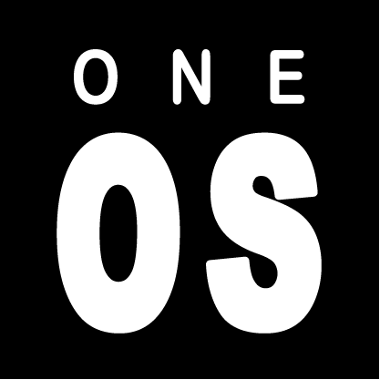
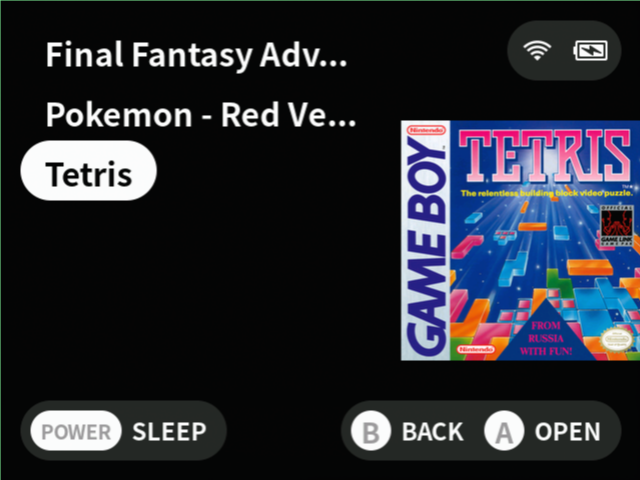
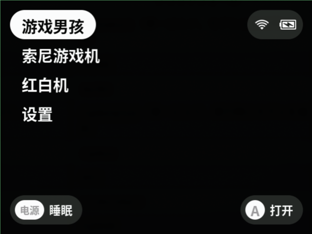
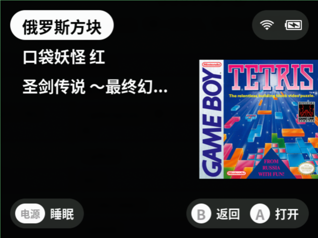

  

# UnuUI

UnuUI is a retro game launcher and libretro frontend. It is a fork of [MinUI](https://github.com/shauninman/MinUI) with added support for CJK (Japanese, Simplified/Traditional Chinese, Korean) as well as French and Spanish.

## Screenshots

Multi-byte ROM names render correctly in all supported languages.

English UI:

| Launcher | Game selected |
| -- | -- |
|  |  |

Simplified Chinese UI:

| Launcher | Game selected |
| -- | -- |
|  |  |

Japanese UI:

| Launcher | Game selected |
| -- | -- |
|  |  |

## Features

- Simple launcher, simple SD card layout
- No configuration
- Multi-byte ROM file names display correctly
- Multi-language UI, including CJK
- Cover art for ROMs and folders
- Collections (custom ROM groupings across consoles)
- In-app screenshot (SELECT+START)
- Auto sleep after 30 seconds; hold POWER to sleep / wake
- Resumes from the previous running state on power on

## Additions from MinUI

UnuUI is a fork of [MinUI](https://github.com/shauninman/MinUI). The following are UnuUI-specific additions on top of the MinUI base.

- **Multi-language UI.** Launcher strings, Tools menu, and libretro frontend options are translated into 7 languages (English, Japanese, Simplified Chinese, Traditional Chinese, Korean, French, Spanish). The language is selected in Settings.
- **CJK font rendering.** Bundled Noto Sans CJK fonts render Japanese, Simplified/Traditional Chinese, and Korean ROM names correctly.
- **UTF-8 safe text truncation.** MinUI's ROM name truncation cut text on byte boundaries, which corrupted (and could crash on) multi-byte characters. UnuUI truncates on codepoint boundaries.
- **Cover art, as a first-class feature.** Put a PNG next to a ROM or folder: `<rom path>/.res/<rom file>.png`. The image is shown on the right side of the launcher when the item is selected. Recommended size: 240×240 max, PNG with transparency. Works for folders too (main platform list).
- **Collections, as a first-class feature.** Create `Collections/<name>.txt` on the SD card containing absolute ROM paths (one per line). The collection appears in the root launcher list and groups ROMs from any console into a single browsable list. Cover art (`Collections/.res/<name>.txt.png`) is supported.
- **Native in-app screenshot.** Hold SELECT + press START anywhere in the launcher or during gameplay to write `Screenshots/YYYY-MM-DD_HH-MM-SS.bmp` to the SD card.
- **Tools menu localization.** Bundled Tools entries (ADBD, Bootlogo, Clock, Files, Input, IP, Remove Loading, Toggle 560p) are shown with localized names instead of their raw `.pak` directory names.
- **ZIP data descriptor support.** MinUI's ZIP loader failed on archives that used ZIP data descriptor mode (bit flag `0x0008`), which is common for Game Boy ROM dumps produced by some tools. UnuUI detects the flag and streams inflate until `Z_STREAM_END`.
- **Text wrap hardening.** Fixed a fixed-size buffer overflow and a NULL dereference in `GFX_wrapText()` that could be triggered by long libretro core option descriptions or long CJK strings.

## Supported languages

- English
- Japanese
- Chinese (Simplified and Traditional)
- Korean
- French
- Spanish

## Supported consoles

- NES / Famicom
- SNES / Super Famicom
- Game Boy
- Game Boy Color
- Game Boy Advance
- Sega Genesis / Mega Drive
- PC Engine / TurboGrafx-16
- Sony PlayStation

## Supported devices

### Tested by maintainer

- Miyoo Mini
- Miyoo Mini Plus
- Miyoo Flip
- Miyoo Mini Flip
- Anbernic RG35XX Plus
- Anbernic RG CubeXX
- Anbernic RG 28XX

### Supported device/platform mapping

| Device | Platform |
| -- | -- |
| Miyoo Mini | `miyoomini` |
| Miyoo A30 | `my282` |
| Anbernic RG35XX Plus / H / 2024 / SP, RG28XX, RG40XX H, RG34XX, RG CubeXX | `rg35xxplus` (single build, model detected at runtime) |
| Anbernic RG35XX (older model) | `rg35xx` |
| Anbernic M17 | `m17` |
| Trimui Smart | `trimuismart` |
| Trimui Smart Pro / Brick | `tg5040` |
| Powkiddy RGB30 | `rgb30` |
| MagicX XU Mini M | `magicmini` |
| MagicX Mini Zero 28 | `zero28` |
| GKD Pixel | `gkdpixel` |

## Anbernic RG*XX installation note

Anbernic RG*XX devices use a two-card StockOS setup. UnuUI follows the same approach as MinUI: keep StockOS on the TF1 card, copy `rg35xxplus/dmenu.bin` to the root of the FAT32 partition on TF1, and copy `UnuUI.zip` to the root of the TF2 card that contains your ROMs. The TF2 card remains the UnuUI/ROM card.

## License

UnuUI inherits MinUI's license. The bundled fonts in the `NotoSansCJK*` family are distributed under the SIL Open Font License (OFL) 1.1.
